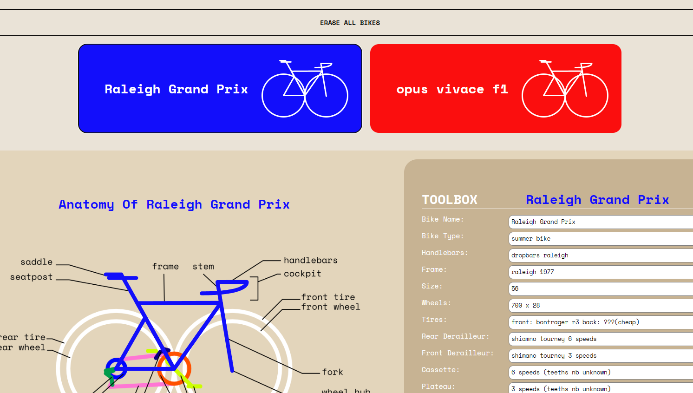

# Interactive Bike Garage!
### For Desktops and mobile

Émile Bédard. CART 263. March 2026

---

View this experience online!: [Interactive Bike Garage](https://emilebedard.github.io/cart263/Projects/project1/Interactive_Bike_Garage)

**Interactive Bike Garage is made for cycling enthusiasts to register bike parts, maintain their vehicles and enjoy their passion of cycling. It serves as a comprehensive inventory for bike parts and a record for both daily upkeep and professional shop visits.**

> Artist Statement: [Click Here To See The Artist Statement](assets/Interactive%20Bike%20Garage%20-%20Artist%20Statement%20-%20Emile%20Bedard.pdf)

---

Image of the Experience:

## Attribution

- This project uses Javascript, Html5 and css
- The image is a screenshot of the *register parts* page
- More than 90% of the code is human written but GenAI helped for certain issues.

## License

> This project is licensed under a Creative Commons Attribution ([CC BY 4.0](https://creativecommons.org/licenses/by/4.0/deed.en)) license with the exception of libraries and other components with their own licenses.

