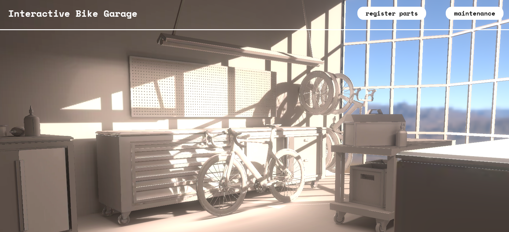

# Interactive Bike Garage II
### For Desktops and mobile

Émile Bédard. CART 263. April 2026

---

View this experience online!: [Interactive Bike Garage II](https://emilebedard.github.io/cart263/Projects/project2/interactive_bike_garage_ii/)

**Interactive Bike Garage is made for cycling enthusiasts to register bike parts, maintain their vehicles and enjoy their passion of cycling. It serves as a comprehensive inventory for bike parts and a record for both daily upkeep and professional shop visits.**

**Version II implements a new modern look for the bike garage, a complete 3D immersive made with Three.JS**

> Artist Statement video walkthrough: [Click Here To See The Artist Statement II Video](assets/artistStatement-videoWalkthrough-IBG2.mp4)

> Artist Statement PDF with screenshots and details: [Click Here To See The Artist Statement II Text](assets/Interactive%20Bike%20Garage%202%20-%20Artist%20Statement%20-%20Emile%20Bedard.pdf)

---

Image of the Experience:

## Attribution

- This project uses Javascript, Three.JS, Html5 and css
- The image is a screenshot of the *main index* page
- More than 90% of the code is human written but GenAI helped for certain issues.

**A few assets were borrowed from online sources to complete the immersive 3D scene:**
- The bicycle 3D models are made by Poojan Pandya, [found on sketchfab.com](https://skfb.ly/pttrz)
- The HDRI Background was captured by Dimitrios Savva and processed by Jarod Guest, [found on PolyHaven.com](https://polyhaven.com/a/drakensberg_solitary_mountain)
Everything else is made by me

## License

> This project is licensed under a Creative Commons Attribution ([CC BY 4.0](https://creativecommons.org/licenses/by/4.0/deed.en)) license with the exception of libraries and other components with their own licenses.

